# StockSage

End-to-end agentic stock analysis application with:
- FastAPI web UI (SSE streaming),
- market data download pipeline,
- CrewAI-based multi-agent analysis,
- deterministic fact overlays for stable presentation.

## About The Project

StockSage accepts a ticker symbol, validates it, downloads market/company data, runs AI analysis tasks, and streams a structured recommendation UI in real time.

Current default flow:
1. Validate symbol (`US` and `IN` formats).
2. Download profile, prices, financials, benchmarks, news/trends.
3. Persist CSV artifacts under `.market_data/<SYMBOL>/`.
4. Run CrewAI task pipeline.
5. Render streamed analysis cards and final recommendation.

## Architecture Overview

```mermaid
flowchart LR
mainPy["main.py"] --> fastapiApp["src/app/main.py"]
fastapiApp --> processor["StockProcessor"]
processor --> download["DownloadPipeline"]
download --> storage["CSVStorage"]
storage --> dataDir[".market_data/<SYMBOL>"]
dataDir --> facts["build_task_facts"]
facts --> analysis["AnalysisPipeline"]
analysis --> formatter["format_log_entry"]
formatter --> sseUi["SSE UI stream"]
```



## Built With

- Python 3.13+
- FastAPI + Uvicorn
- CrewAI
- LiteLLM
- Pandas / NumPy
- yfinance / pytrends / gnews
- Jinja2

## Getting Started

### Prerequisites

- Python `>=3.13`
- `uv` (recommended) or `pip`
- Optional local model runtime (e.g. Ollama) if using default local LLM config

### Installation

```bash
git clone <your-repo-url>
cd StockSage
uv sync
```

Optional Jupyter (not used by the web app):

```bash
uv sync --extra notebook
```

If you do not use `uv`:

```bash
python -m venv .venv
source .venv/bin/activate
pip install -e .
# Optional: pip install -e ".[notebook]"
```

### Environment

Create `.env` in repository root as needed:

```env
SERPER_API_KEY=...
# Optional depending on selected LLM provider:
# OPENAI_API_KEY=...
# ANTHROPIC_API_KEY=...
# GEMINI_API_KEY=...
# GROQ_API_KEY=...
```

## Usage

Run the app:

```bash
uv run uvicorn src.app.main:app --reload
```

Open:
- `http://127.0.0.1:8000/` (main UI)
- `http://127.0.0.1:8000/docs` (OpenAPI)

Enter a symbol (examples: `AAPL`, `MSFT`, `RELIANCE.NS`) and start analysis.

## Data Output

Downloaded artifacts are saved under:

```text
.market_data/<SYMBOL>/
```

Typical files include `company_info.csv`, `daily.csv`, `historical_prices.csv`, `income_statement.csv`, `cash_flow.csv`, `recommendations.csv`, `news.csv`, and benchmark CSVs.

## Configuration

Core configuration lives in:
- `src/core/config/config.py`
- `src/core/config/data_contracts.py`

Key settings:
- `LLM_MODEL`
- `LLM_TEMPERATURE`
- `LLM_MAX_TOKENS`
- `LLM_TIMEOUT`
- output directory path and CSV contracts

## Limitations

- Analysis quality depends on provider/model quality and external data availability.
- Network/API issues can degrade or skip non-critical data steps.
- Single-symbol request flow (no built-in batch orchestration).

## Troubleshooting

- **Container `Killed` on Railway (no traceback)**: Linux OOM — raise service memory to **≥1 GB**. The default app image no longer installs Jupyter; if you still see kills at 512 MB, bump RAM further or reduce concurrent analyses.
- **No analysis output**: check LLM provider setup and credentials.
- **Missing external sentiment/news context**: verify `SERPER_API_KEY`.
- **Validation failures**: verify symbol format (`US`: `AAPL`, `IN`: `RELIANCE.NS` or `.BO`).
- **Slow first run on local models**: model warm-up can be significant.

## Contributing

1. Create a branch.
2. Keep changes scoped and behavior-safe.
3. Run tests/lint before PR.
4. Submit PR with a concise test plan.

## Acknowledgments

README structure adapted from the Best README Template:
- [othneildrew/Best-README-Template](https://github.com/othneildrew/Best-README-Template)
