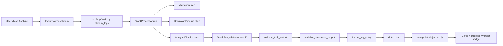

# StockSage Walkthrough (Step-by-Step Debug Guide)

This document is a practical walkthrough of what happens from click to UI render, with focus on the issues you reported:

1. Agent output is good, but UI representation is off (especially sentiment labels)
2. US stocks failing in sentiment step
3. Progress feels hung for minutes
4. UI hierarchy feels inconsistent
5. Need a clean debug mode (less verbose noise)

---

## 1) End-to-end flow at a glance

---

## 2) Backend pipeline walkthrough

### A. Request entry
- File: `src/app/main.py`
- Endpoint: `/stream?symbol=...`
- `stream_logs()` starts a background producer thread and streams SSE frames:
  - `data: ...` for normal messages
  - `: ping` heartbeats every 10s when idle
  - `event: stream_error` on backend errors
  - `event: complete` at the end

### B. Processing orchestration
- File: `src/core/processing/processor.py`
- `StockProcessor.run()` stages:
  1. `STARTING`
  2. `VALIDATING`
  3. `DOWNLOADING_DATA`
  4. `ANALYZING`
  5. `COMPLETE`
- Current protection: `_ACTIVE_ANALYSIS_LOCK` allows only one in-flight analysis per instance.

### C. Analysis and task execution
- File: `src/crew/pipeline.py`
- `AnalysisPipeline.run()`:
  - Runs `StockAnalysisCrew().crew().kickoff(...)`
  - Handles structured output validation/retry
  - Handles 429 rate-limit retry with jitter (up to 3)
  - Builds deterministic facts and prepends them to task output
  - Emits substage logs for each task

### D. Structured output conversion
- File: `src/crew/structured_output.py`
- For each task:
  - Validate model-specific schema (`SentimentOutput`, etc.)
  - Serialize to line-based text (e.g., `Sentiment Signal: Positive`)
- This serialized text is what the UI formatter consumes.

---

## 3) UI rendering walkthrough (where data can look wrong)

### A. SSE client and progress
- File: `src/app/static/js/main.js`
- `startProcessing()` creates `EventSource('/stream?...')`
- On each message:
  - appends HTML from backend
  - tries to infer step progress from text matching:
    - `Valuation & Profitability...`
    - `Price Performance & Risk...`
    - `Financial Health...`
    - `Market Sentiment...`
    - `Quality Review...`
    - `Investment Report...`

### B. Why progress can feel stuck
- Progress advances only when matching those step-title strings.
- During long LLM calls, there may be heartbeats but no new step label.
- So the user sees no step movement even though backend is alive.

### C. Why sentiment can look wrong on card
- File: `src/app/utils/formatters.py`
- Header badge is inferred by regex over raw text (`positive`, `negative`, `neutral` words).
- If wording is mixed, badge detection can drift from true model signal.
- Structured signal exists (`Sentiment Signal: Positive`) but UI badge currently still relies on text pattern precedence.

---

## 4) Reported issues mapped to exact code points

## Issue 1: "Agent output good, but UI not putting it correctly"
- Primary renderer: `format_log_entry()` in `src/app/utils/formatters.py`
- Sentiment badge logic: `_extract_card_badge()` + `_CARD_SENTIMENT_PATTERNS`
- Structured sentiment is available in serialized lines via `serialize_structured_output()` but badge is regex-derived.

Debug check:
1. In logs, inspect emitted sentiment block text.
2. Confirm `Sentiment Signal: ...` line is present.
3. Compare with resulting badge class in card header.

## Issue 2: "US stocks failing in sentiment"
- Sentiment task definition: `src/crew/config/tasks.yaml`
- Search tool volume: `src/crew/tools/search.py` (`n_results` now reduced)
- Likely failure mode: token/rate pressure during sentiment stage due to live search payload + model limits.

Debug check:
1. Confirm failure text from `AnalysisPipeline` includes 429 or structured validation error.
2. Confirm sentiment task receives compact citations, not huge payload.
3. Validate `SERPER_API_KEY` and external search reliability.

## Issue 3: "No progress bar / hangs"
- Progress update is text-trigger based in `main.js`.
- If there are long gaps between substage markers, bar appears frozen.
- Heartbeats keep stream alive but do not currently advance step.

Debug check:
1. Browser console: ensure EventSource remains open.
2. Network tab: confirm SSE receives `: ping` comments.
3. Ensure `analyzing_*` IN_PROGRESS logs are emitted before each task.

## Issue 4: "UI all over the place"
- Card order is normalized by `reorderAnalysisCards()` in `main.js`.
- But section-level body content comes from complex parsing rules in `formatters.py`.
- Inconsistent model text structure can produce uneven card internals.

---

## 5) Debug mode recommendation (temporary)

Goal: reduce noise and inspect output deterministically.

### A. Disable Crew verbose chatter
- File: `src/crew/crew.py`
- For temporary debug:
  - Set each `Agent(..., verbose=False)`
  - Set `Crew(..., verbose=False)`

### B. Keep only structured output path
- File: `src/crew/pipeline.py`
- Temporarily prefer:
  - `output_text = structured_text`
  - skip fallback to `str(task_output)` unless structured is empty

### C. Add one debug marker per task
- In analysis loop, emit log with:
  - task name
  - structured model validation pass/fail
  - output length

This makes it obvious whether the issue is model output, serializer, or formatter.

---

## 6) Concrete review checklist (run top to bottom)

1. Trigger one symbol (`AAPL`) and record full SSE stream.
2. For each task, confirm:
   - task started (`IN_PROGRESS`)
   - task succeeded (`SUCCESS`)
   - structured model validated
3. For sentiment:
   - check exact serialized lines
   - verify badge derivation matches sentiment signal
4. Confirm progress steps advance 1..6 based on received events.
5. Confirm final `complete` event is received.
6. Compare UI card content vs serialized source text.

---

## 7) Proposed short-term cleanup plan (minimal, non-bloated)

1. Make sentiment badge derive from explicit line `Sentiment Signal: X` first, regex second.
2. Emit dedicated SSE event per substage (`event: stage`) and drive progress from event, not string matching.
3. Add a compact "currently running: <task>" status label in UI.
4. Keep search payload tight for sentiment (already reduced).
5. Keep verbose off in production; enable via env flag when debugging.

---

## 8) Wireframe input

Yes, you can absolutely share a wireframe. That is the fastest way to fix the UI consistency issue.

Best format:
- one screenshot/wireframe with labeled blocks:
  - top summary
  - progress area
  - analysis cards
  - sentiment/news section
  - final recommendation block
- plus 3 rules:
  - visual priority order
  - what must always be visible
  - what can be collapsible

I can then map wireframe -> exact DOM/CSS/component changes with minimal churn.

